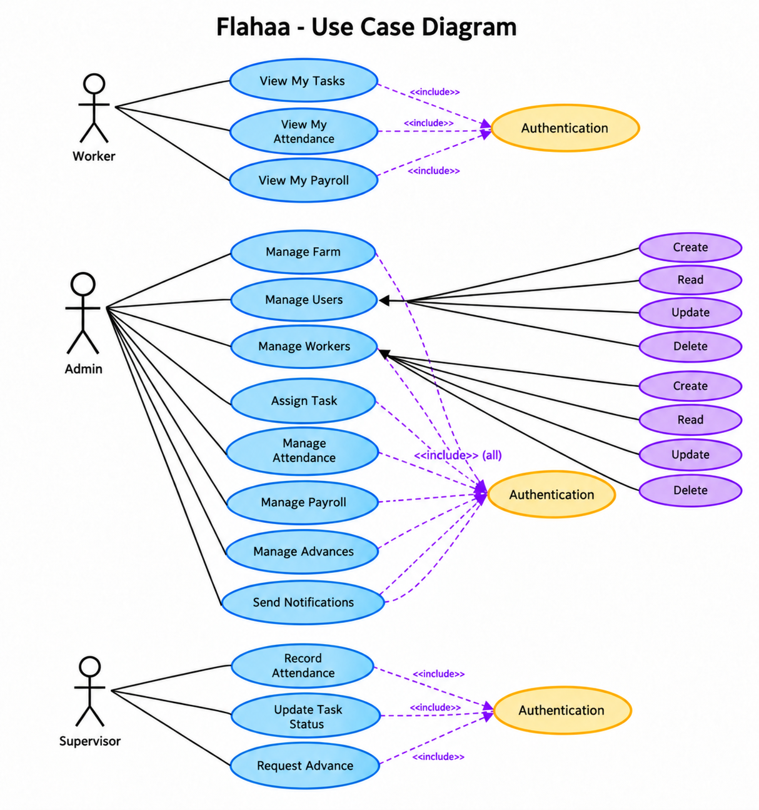
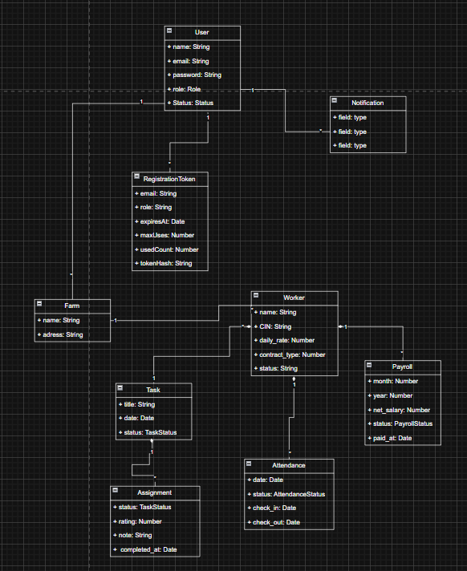
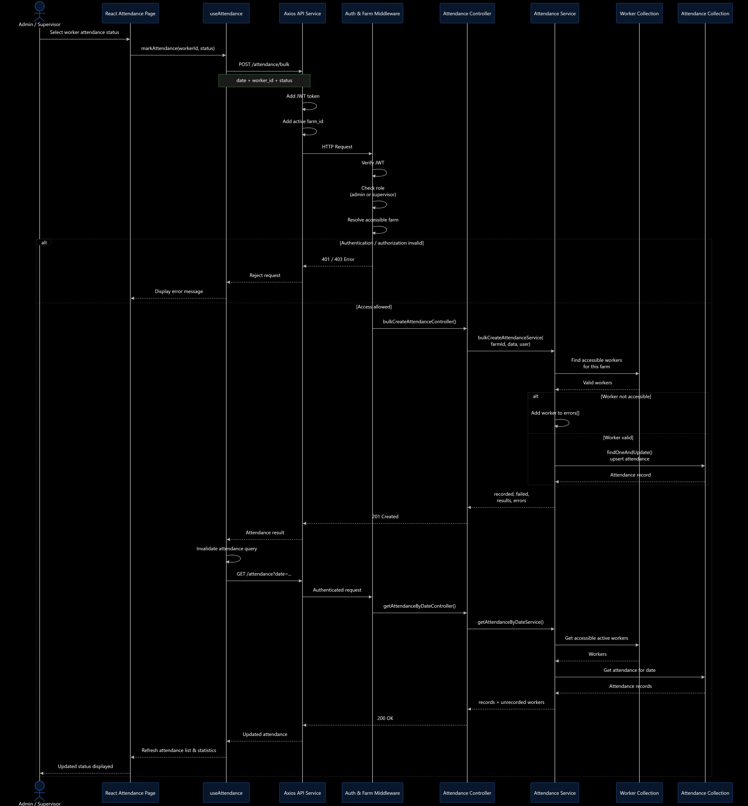

# Flahaa

Flahaa is a full-stack farm workforce management platform. It gives farm owners and supervisors one place to manage farms, workers, attendance, tasks, and payroll, while workers can access their assigned tasks.

The application is split into a React frontend and an Express/MongoDB backend. Authentication is JWT-based and all operational data is scoped to a farm.

## Main capabilities

- Multi-farm administration with farm selection for administrators.
- Worker and supervisor management, including worker invitations and profile images.
- Attendance recording for `present`, `absent`, and `excused` statuses, including bulk entry and monthly summaries.
- Task creation, assignment, progress updates, worker status updates, and ratings.
- Payroll calculation from attendance and worker rates, with bonuses, deductions, advances, paid status, and PDF output.
- Registration-token invitations for supervisors and workers.
- Dashboard summaries and REST API documentation through Swagger.
- Request validation with Zod, protected routes, rate limiting, Helmet, CORS, bcrypt, and farm-level authorization.

## Roles and access

| Role | Access |
| --- | --- |
| Admin | Owns farms; manages farms, supervisors, workers, attendance, tasks, and payroll. |
| Supervisor | Operates within an assigned farm; manages workers, attendance, and tasks. |
| Worker | Views assigned tasks and updates the status of their own task assignments. |

Every protected request passes through authentication and, where applicable, role and farm guards. Admin requests resolve the selected farm against farms owned by the admin. Non-admin requests use the farm assigned to the authenticated account.

## Architecture

```text
Browser (React/Vite) -> Axios / JSON / JWT -> Express API
                                             |
       Helmet, CORS, Morgan; validation/auth/farm middleware
                                             v
                              Routes -> controllers -> services
                                             |
                                             v
                                      Mongoose -> MongoDB
```

The backend exposes `/api/auth`, `/api/farms`, `/api/users`, `/api/workers`, `/api/attendance`, `/api/tasks`, `/api/payrolls`, `/api/registration-tokens`, and `/api/dashboard`.

## Project layout

```text
Flahaa/
├── backend/src/{config,controllers,middlewares,models,routes,services,tests}
├── frontend/src/{components,hooks,pages,services,store}
└── docs/diagrams/
```

## Diagrams

The diagrams are maintained in [`docs/diagrams/`](docs/diagrams/):

- [Use-case diagram (PNG)](docs/diagrams/useCase.png)
- [Class diagram (PNG)](docs/diagrams/class.png)
- [Sequence diagram (PNG)](docs/diagrams/Sequence.png)
- [UML/domain diagram (draw.io)](docs/diagrams/UML.drawio)





The use-case diagram covers Admin, Supervisor, and Worker workflows. The UML diagram documents the main domain entities and their relationships. Update the source diagram whenever a domain model or role workflow changes.

## Technology stack

Frontend: React 19, Vite, React Router, Tailwind CSS, Zustand, TanStack React Query, Axios, Chart.js, and Lucide React.

Backend: Node.js, Express 5, MongoDB, Mongoose, JWT, bcrypt, Zod, Multer, Cloudinary, Nodemailer, PDFKit, Swagger, Helmet, CORS, Morgan, and express-rate-limit.

Testing: Vitest, Supertest, and MongoDB Memory Server.

## Prerequisites

- Node.js and npm
- MongoDB or MongoDB Atlas
- Cloudinary credentials for image uploads
- SMTP/Mailtrap credentials for invitation emails

## Local development

```bash
git clone https://github.com/Mouad-MCH/Flahaa.git
cd Flahaa

cd backend
npm install
cp .env.example .env
npm run dev
```

In another terminal:

```bash
cd frontend
npm install
npm run dev
```

The API defaults to `http://localhost:3030` and Vite normally serves the frontend at `http://localhost:5173`.

Docker Compose is also available. The frontend container is exposed on port `8080` and proxies `/api/` requests to the configured backend.

## Environment variables

Backend configuration is validated at startup. Copy `backend/.env.example` to `backend/.env` and configure at least:

```env
NODE_ENV=development
APP_STAGE=dev
PORT=3030
MONGODB_URI=mongodb://localhost:27017/flahaa
JWT_SECRET=replace-with-a-secret-of-at-least-30-characters
JWT_REFRESH_SECRET=replace-with-another-secret-of-at-least-30-characters
JWT_EXPIRES_IN=15m
JWT_REFRESH_EXPIRES_IN=7d
FRONTEND_URL=http://localhost:5173
CORS_ORIGIN=http://localhost:5173
```

Configure Cloudinary and SMTP variables when using uploads or invitation emails. Never commit real secrets.

## API documentation and health check

- Health check: `GET http://localhost:3030/health`
- Swagger UI: `http://localhost:3030/api-docs`
- OpenAPI JSON: `http://localhost:3030/api-docs.json`

Protected endpoints expect `Authorization: Bearer <jwt>`.

## Tests and build

```bash
cd backend
npm test

cd ../frontend
npm run build
```

## Project status

The backend contains the core farm-management domains and automated unit/integration coverage. The frontend includes authentication, farm selection, protected routing, dashboard, worker, supervisor, attendance, task, payroll, and worker-task screens.

## Author

Developed by [Mouad MCH](https://github.com/Mouad-MCH).
